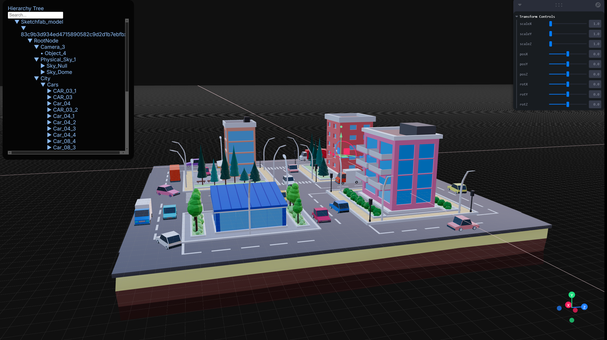
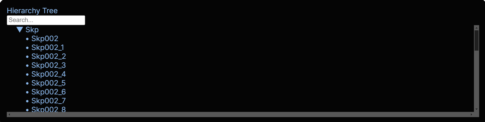
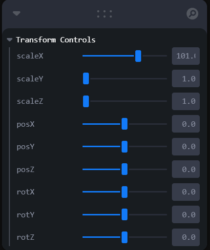

### **🖥️ Simple 3D Viewer**  
_An app to explore and control 3D objects in a scene!_



---
#### 🔗 Live Demo  
_[Check out the deployed app here!](https://threejs-editor-app.vercel.app/)
---

#### **📌 Features**  
-Drag and drop the 3d model
- View a hierarchical **3D Model- .gltf & .glb supported** 🏗️  
- Click on objects to **select and highlight them** 🔦  
- Modify **Position, Rotation, and Scale** using simple UI controls 🎰  
  _(Color and animation controls are being built)_

---

### **🚀 Setup Instructions**  
### **1️⃣ Clone the Repo**  
```bash
git clone 
cd to your folder
```

### 🚀 Getting Started  

### **1️⃣ Prerequisites**  
Make sure you have the following installed:  
- **Node.js** (Recommended: v18+) → [Download Here](https://nodejs.org/)  
- **npm** (Comes with Node.js) → Check version:  
  ```sh
  node -v
  npm -v


### **2️⃣ Install Dependencies**  
```bash
npm install
@react-three/drei
@react-three/fiber
leva
react
react-dom
react-dropzone
sass
sweetalert2
three
```

### **3️⃣ Run the App**  
```bash
npm run dev 
```
_Open in your browser at **http://localhost:????** 🎉_

---

### **🔗 Deployed Demo**  
Check out the live version here: [Demo Link]([https://your-demo-link.com](https://threejs-editor-app.vercel.app/)) 

---

### **🛠️ Technical Overview**  
### **📂 Project Structure**  
```
/src
  ├── components
  │     ├── HierarchyTree.jsx  // Extracts scene hierarchy
  │     ├── TreeSceneGraph.jsx  // Recursively renders the scene graph
  │     ├── TransControls.jsx  // Position, Rotation, and Scale UI
  ├── assets  // Images, textures, and 3D models
  ├── App.js  // Main entry point
```
### **📂 UI Preview** 



### **🎮 How It Works**  
1️⃣ `HierarchyTree.jsx` grabs the 3D scene and builds a structured tree.  
2️⃣ `TreeSceneGraph.jsx` recursively renders the scene as a **clickable hierarchy**.  
3️⃣ `TransControls.jsx` lets users modify **position, rotation, and scale** of selected objects.  

---

### **🎬 Demo Video & GIFs** *(Add these later!)*  
🚀 **[Watch it in action!](#)** *(https://www.loom.com/share/96a8692c7ba342abaaf0e886e432fcce?sid=aff9ece7-efeb-4249-87c1-54526afc9524)*  

---

### **💡 Fun Facts**  
🎨 Inspired by **Blender’s transformation panel**  
🔥 Uses **React** for UI & **Three.js** for 3D rendering  
🐱 The first test object was a **House Model**! (Okay, maybe it wasn’t... or was it? I'm obssed with Buildings😼)  

---

### **👨‍💻 Working on**
🐱   (okey!!... I know this is just first version and needs many iterations for pixel perfect)
🚀  -Color/Material controls
🚀  -Animation Values are passed on to UI controls but needs UI data manipulation to be captured and updated in Model
🚀  -Reset button for TrasformControls UI
🚀  -Need more finetuning in Model transform from controls

---

